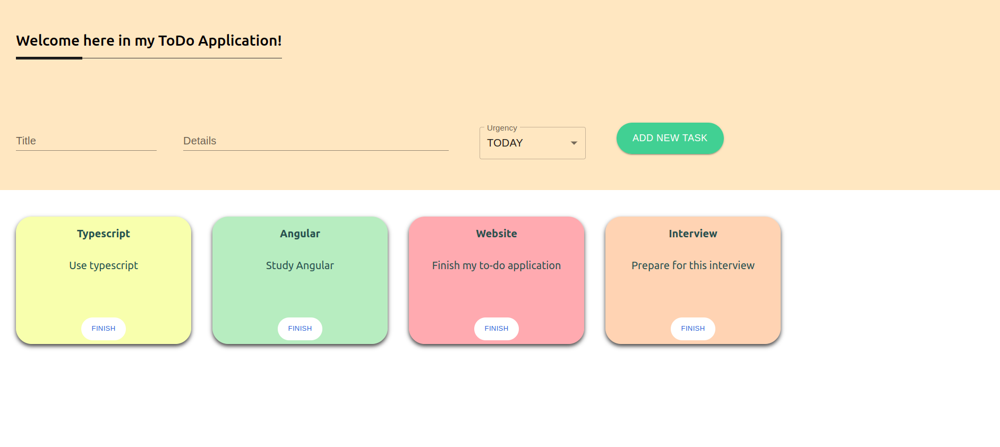

# Simple ToDo Application
- This is a React application where I used typescript and material UI for the first time.
- User can add tasks and delete them when they are finished.
- My biggest challenge: using CSS with material UI.

## Features
- The background color of the task cards depends on the urgency.
- Application stores tasks in localstorage.

## Technology

- React
- CSS
- Typescript
- Material UI
- AWS Amplify

## Getting Started

- This application is deployed on AWS, so just click [here](https://main.d23sxx0ohyehql.amplifyapp.com/) and try it.
